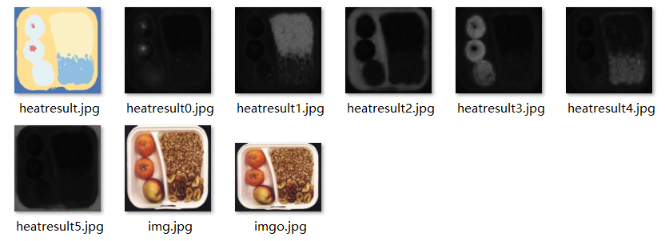

# Biomimetic Visual Perception Network for Industrial Image Anomaly Detection
**IEEE Transactions on Automation Science and Engineering (T-ASE)**

**For Double-Anonymous Peer Review in IEEE T-ASE**

This ANONYMOUS repository contains source code for BVPN implemented with PyTorch. Our implementation supports both Windows and Linux systems.


Anomaly detection in the industrial manufacturing process is important for controlling product quality. In realworld scenarios, anomalies manifest in a number of diverse and unforeseen ways and can be categorized into two main types: structural anomalies, such as scratches and breakages, and logical anomalies, such as missing components and dislocations. Current mainstream methods tend to focus on knowledge generalization but are inadequate for detailed and logical detection tasks. To address this issue, this study proposes Biomimetic Visual Perception Network (BVPN), a biomimetic design-based novel paradigm that simulates biological vision and human logical discrimination with detailed distillation dependencies and semantic component information. BVPN introduces three convolutionbased networks to extract information from different regions, imitating biological central, para-central, and peripheral vision, and facilitates the integration of disparate information through the process of knowledge distillation. On the basis, BVPN develops two modules based on the student-teacher network: Focus Module, for local detailed detection, and Peripheral Module, for global context detection. Moreover, BVPN proposes the Logical Module, a clustering-based segmentation branch, assessing logical anomalies by the number and color information of segmentation components. Through a fused structure highly aligning with the perception mode of human system, BVPN achieves excellent performance in the detection of structural and logical anomalies. Extensive experiments with mainstream anomaly detection datasets and real-world inkjet printing dataset demonstrate that BVPN outperforms state-of-the-art competitors in accuracy.

## Data Preparation
The official links of public datasets employed in the paper are listed below.  
[MVTec-AD](https://www.mvtec.com/company/research/datasets/mvtec-ad/downloads)  
[MVTec-LOCO](https://www.mvtec.com/company/research/datasets/mvtec-loco/downloads)  
[VisA](https://amazon-visual-anomaly.s3.us-west-2.amazonaws.com/VisA_20220922.tar)  

**The downloaded dataset format is as follows:**

```
path to mvtec
├── mvtec
    ├── bottle
        ├── train
            ├── good
                ├── 000.png
        ├── test
            ├── good
                ├── 000.png
            ├── anomaly1 (e.g. broken_large)
                ├── 000.png
            ├── anomaly2
            ├── ---
        ├── ground_truth
            ├── anomaly1
                ├── 000.png
```

## Run
**Run loco23.py for traing or testing**
```
parser.add_argument('-train', '--is_train', default=True) # True for training    False for testing
```
Example results are as follows:


**Run FeatUP/seg_image.py for unsupervised semantic segmentation**
If you want to perform semantic segmentation, you can run seg_image.py.
Example results are as follows:



